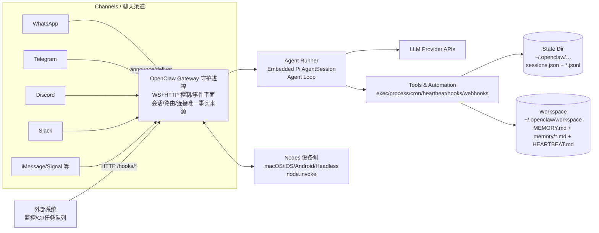
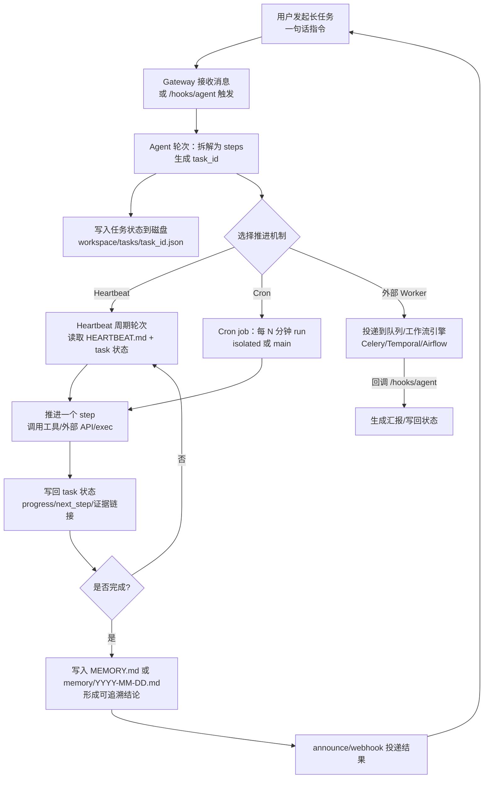

# OpenClaw 实现 24/7 持续运行与长任务自动推进的工程化研究报告

## 执行摘要

OpenClaw 的“24/7”能力本质上不是让大模型“永远在线思考”，而是通过**长期运行的 Gateway 守护进程**持续接入多渠道消息，并用**Heartbeat（心跳）+ Cron（定时任务）+ Hooks/Webhooks（事件/外部触发）**在合适的时间点唤起“智能体轮次（agent turn）”来推进工作；同时把会话历史与记忆落盘，保证可恢复与可追踪。官方文档明确：Gateway 是会话、路由和渠道连接的唯一事实来源，并作为控制/事件平面的常驻进程运行到被停止为止，出现致命错误时以非零退出码退出以便 supervisor 重启。citeturn2view2turn2view3turn9view0

你遇到“只能以问答式交互推进任务”的常见根因，往往不是“能力缺失”，而是：**（1）Gateway 没有被真正以守护进程方式留在后台（systemd 用户服务注销即停等）；（2）Heartbeat 被禁用或 HEARTBEAT.md 没有可执行的待办，导致系统刻意不去‘凭空继续旧任务’；（3）长任务超过默认超时（智能体运行默认 600s）；（4）长时间 shell 任务虽然能后台跑，但 OpenClaw 的 `process` 会话仅存内存、重启即丢；（5）工具审批/权限策略让执行在“等待批准”处卡住；（6）并发与队列序列化导致看上去像“必须问一句才动一下”。citeturn13view0turn29view2turn10view0turn17view0turn4search0turn11view1turn29view0

关键建议（按优先级）：
1) 先把“持续运行”工程底座打牢：确保 Gateway 由 launchd/systemd 监管并在注销后仍常驻（Linux 常见需 enable-linger 或改系统服务）。citeturn2view3turn13view0  
2) 把“任务推进”从聊天上下文迁移到**可落盘的任务状态**：用 `HEARTBEAT.md`/`memory/*.md`/任务 JSON 文件作为事实来源（避免只靠对话）。citeturn12view2turn12view3turn29view2  
3) 用 Cron/Heartbeat 驱动“自动轮次”，并把投递目标从默认 last 改为明确渠道/收件人，保证你能看到进度。citeturn12view2turn3search1turn19search0  
4) 对“小时级/天级”的长任务，避免依赖 `process` 内存会话：把重活下沉到外部 worker/工作流引擎（Celery/Temporal/Airflow 等），OpenClaw 负责触发、轮询与汇报。citeturn17view0turn30search2turn30search4  
5) 落实可观测与故障排查：启用结构化日志、OTel/OTLP 导出（如需），监控关键队列等待、超时、重启、Webhook 401/429、工具审批等指标。citeturn18view0turn17view1  

## 技术背景

### 架构与组件全景

OpenClaw 的官方定义是：**自托管的 Gateway**，把 WhatsApp/Telegram/Discord/iMessage 等聊天应用连接到“像 Pi 这样的编程智能体”，你在自己的机器或服务器上运行一个 Gateway 进程，它成为消息应用与随时可用 AI 助手之间的桥梁。citeturn2view1turn2view2  

从官方“Gateway 网关架构”文档看，OpenClaw 的核心组件可以抽象为：
- **Gateway（守护进程）**：单个长期运行的进程，拥有所有消息平台连接（文档举例：WhatsApp（Baileys）、Telegram（grammY）等），并对外提供 WebSocket 控制平面（默认 `127.0.0.1:18789`）以及同端口复用的 HTTP 服务能力。citeturn9view0turn5view1  
- **客户端（macOS App / CLI / Web 控制界面 / WebChat）**：各自通过 WS 与 Gateway 建立连接，发请求（如 `agent`/`send`/`health`）并订阅事件（如 `tick`/`agent`/`presence`/`shutdown`）。citeturn9view0turn5view1  
- **Nodes（macOS/iOS/Android/无头设备）**：同样通过 WS 连接，但以 `role: node` 声明能力，对外暴露设备相关动作（camera、screen.record、location 等），供工具调用路由到“设备侧执行”。citeturn9view0turn2view0  
- **Agent Runner（智能体运行时）**：官方说明 OpenClaw 运行一个源自 pi-mono 的嵌入式智能体运行时，工作区文件会在会话第一轮注入上下文；会话记录以 JSONL 落盘。citeturn7view1turn10view0  

关于 Pi 的集成方式，官方“Pi 集成架构”文档明确写道：OpenClaw 通过 pi SDK 嵌入 AgentSession（`createAgentSession()`），而不是把 pi 作为子进程或 RPC 模式运行；此嵌入式方式带来对会话生命周期/事件处理的控制、工具注入、会话持久化、认证配置文件故障转移等能力。citeturn7view0turn10view0  
与此同时，中文首页仍保留“默认使用内置 Pi 二进制文件以 RPC 模式运行”的表述，可能反映不同发行形态或文档更新节奏差异；落地时建议以你当前版本的 `openclaw status`/源码与配置为准。citeturn6search1turn12view0  

### 运行模式与持续运行机制

OpenClaw 的持续运行依赖“Gateway 进程 + OS 级监管”：
- “Gateway 网关运行手册”说明：Gateway 是常驻进程，**运行直到停止**；致命错误以非零退出码退出，便于 supervisor（launchd/systemd）重启；日志输出到 stdout，并建议用 launchd/systemd 保持运行与轮转日志。citeturn2view3turn5view1  
- Linux 场景下，官方“设置”文档强调：默认 systemd **用户服务在注销/空闲时会停止**，从而终止 Gateway；需要启用 lingering（`sudo loginctl enable-linger $USER`）或改用系统服务。citeturn13view0  

### 任务调度、状态管理、持久化、并发、容错

任务调度（“自动推进”的关键）在 OpenClaw 里主要由 4 类机制组成：

1) **Heartbeat（心跳）**：在主会话中周期性运行智能体轮次（默认 30m），并推荐在工作区中创建 `HEARTBEAT.md` 检查清单；默认提示词要求“严格按 HEARTBEAT.md 执行”，无事则回复 `HEARTBEAT_OK`，并提供 activeHours、投递目标等配置。citeturn12view2turn29view2  

2) **Cron（定时任务）**：官方把 Cron 定义为“Gateway 内置调度器”，任务持久化在 `~/.openclaw/cron/jobs.json`，重启不丢；支持两种执行：  
- 主会话模式：入队 system event，并在下一次心跳时用主会话上下文运行；  
- 隔离模式：在 `cron:<jobId>` 中跑专用智能体轮次（每次一个全新会话 ID，不继承上次对话），可选择投递摘要或不投递，并支持“now/next-heartbeat”的唤醒能力。citeturn3search1turn12view1  

3) **Hooks/Webhooks（事件驱动与外部触发）**：  
- Hooks：当命令或生命周期事件触发时，在 Gateway 内运行小脚本；官方文档解释了 Hook 的发现路径、启用方式与典型用途（审计、会话记忆快照等）。citeturn19search2  
- Webhooks：Gateway 可暴露 `/hooks` 端点，由外部系统触发“wake”或“agent”执行；文档明确 hooks.enabled 时 token 必填，并给出 `/hooks/wake` 和 `/hooks/agent` 的请求体、投递与 wakeMode 语义。citeturn19search0  

4) **命令队列（并发与串行化）**：  
- 文档“命令队列”说明：为防止冲突，OpenClaw 用**进程内队列**序列化入站自动回复运行，同时允许跨会话安全并行；`runEmbeddedPiAgent` 会按会话键入队，整体并行度受 `agents.defaults.maxConcurrent` 限制，并提供 steer/collect/followup 等队列模式。citeturn11view1turn10view0  
- 源码 `command-queue.ts` 也直接写明这是“Minimal in-process queue”，并通过 lanes 支持一定并行（例如 cron jobs），同时在“gateway draining for restart”时拒绝新任务并抛出专门错误，体现了“重启/排空”的容错语义。citeturn29view0  

状态管理与持久化方面，官方给了非常“可操作”的落盘路径：
- **会话状态由 Gateway 拥有**（UI 客户端必须向 Gateway 查询会话列表与 token 计数，而不是读本地文件）；会话 store 文件与 JSONL 对话记录位于 Gateway 主机的 `~/.openclaw/agents/<agentId>/sessions/`。citeturn3search2turn13view0  
- **记忆（Memory）**是工作区中的 Markdown 文件，并强调这些文件是唯一事实来源，“模型只记住写入磁盘的内容”；默认工作区会使用 `memory/YYYY-MM-DD.md` 与可选的 `MEMORY.md` 两层。citeturn12view3turn4search2  
- 迁移指南强调：要迁移/备份必须复制状态目录 `$OPENCLAW_STATE_DIR`（默认 `~/.openclaw/`，含配置/认证/会话/渠道状态）以及工作区（默认 `~/.openclaw/workspace/`）。citeturn12view0  

容错与可观测性方面：
- 渠道侧有明确重试策略（如 Telegram/Discord 的 429/瞬态错误重试与退避），并支持在 `openclaw.json` 配置 attempts/minDelay/maxDelay/jitter。citeturn11view0  
- Gateway WS 会通过 tick 或 ping/pong 做保活，但事件**不会重放**，客户端检测到 seq 间隙需刷新；这对“长任务进度展示”有直接影响（不要只依赖流式事件，最好用消息投递/持久化状态）。citeturn5view1turn9view0  
- 日志默认写入 `/tmp/openclaw/openclaw-YYYY-MM-DD.log`（JSONL），并可用 `openclaw logs --follow` 通过 RPC tail；文档还提到 Diagnostics + OpenTelemetry（OTLP/HTTP）用于模型运行与消息流遥测。citeturn18view0  

### 架构示意图



该图依据官方对“单 Gateway 常驻、WS 控制平面、会话由 Gateway 拥有、Nodes 同 WS 接入、Heartbeat/Cron/Hooks/Webhooks” 等描述抽象而来。citeturn9view0turn3search2turn12view2turn3search1turn19search0  

## 常见限制与原因分析

下表把“只能问答式推进”的高频原因按**证据链**整理（每行给出能直接落地的修复方向）：

| 现象（你看到的） | 根因（机制层解释） | 证据/引用（来自 OpenClaw 官方/源码） | 直接影响 | 修复方向（概览） |
|---|---|---|---|---|
| 你不发消息它就不动，无法后台继续任务 | 你只在“消息触发”通道使用 OpenClaw，没有启用/利用 Heartbeat/Cron/Webhook 来产生“无用户输入的智能体轮次” | Heartbeat：周期性在主会话运行；Cron：Gateway 内置调度器并可唤醒心跳；Webhooks：外部可触发 wake/agent。citeturn12view2turn3search1turn19search0 | 任务推进完全依赖你“追问” | 用 HEARTBEAT.md + heartbeat.every，或用 cron add（wake now/next-heartbeat），或让外部系统回调 /hooks/agent |
| 以为开了心跳但实际“心跳基本什么也不做” | HEARTBEAT 的默认提示词刻意要求“只按 HEARTBEAT.md”，且源码会判断 HEARTBEAT.md 是否“有效为空”（只有标题/空行/空 checklist）来跳过 API 调用 | 默认 prompt：“Read HEARTBEAT.md…If nothing needs attention, reply HEARTBEAT_OK”；并提供“effectively empty”判断以跳过调用。citeturn12view2turn29view2 | 你感觉系统“很被动”，其实是“缺少可执行待办/状态” | 把待办与条件写进 HEARTBEAT.md；把任务状态落盘，让心跳能“读文件->决策->推进” |
| Gateway 经常不在线（夜里/断开终端后就停），谈不上 24/7 | Gateway 没有被 supervisor 监管，或 Linux 使用 systemd **用户服务**导致注销/空闲即停；OpenClaw 明确提示需 enable-linger 或改系统服务 | Gateway 运行手册：致命错误非零退出给 supervisor 重启；设置文档：systemd 用户服务注销会终止 Gateway，需 `loginctl enable-linger`。citeturn2view3turn13view0 | 自动化触发不到、Cron/Heartbeat 都不会跑 | 用 `openclaw onboard --install-daemon` + `openclaw gateway install/status`；Linux：enable-linger 或 systemd system unit |
| 长任务执行一半被“超时”打断 | 智能体运行时有默认超时；官方“智能体循环”写明 `agents.defaults.timeoutSeconds` 默认 600s，并在 runEmbedded 中强制中止；Gateway 也会返回 `AGENT_TIMEOUT` 错误码 | 超时：智能体运行默认 600 秒；错误码包含 `AGENT_TIMEOUT`。citeturn10view0turn5view1 | 单次轮次无法完成“分钟级以上”的工作 | 把任务拆成多轮（状态落盘），用 Cron/Heartbeat 驱动后续轮次；必要时提高 timeoutSeconds（但要配合成本/风控） |
| shell/构建/训练类任务跑很久，重启/崩溃后无法续 | `exec` + `process` 支持后台，但官方说明：后台会话**仅存在内存**、重启即丢，不做磁盘持久化 | “Background Exec + Process Tool”：长任务保存在内存；“Sessions are lost on process restart (no disk persistence)”。citeturn17view0turn4search0 | 你只能“问一句、等一会、再问一句”，且遇到重启就全断 | 对“小时级任务”把执行下沉到外部守护（systemd-run/tmux/独立 worker），OpenClaw 负责轮询与汇报 |
| 执行卡在某一步，直到你手动确认才继续 | 工具安全策略/审批：host=gateway 或 node 的 exec 可能返回 `approval-pending`，需要人工批准后才会继续 | Exec 工具文档：需要审批时立即返回 `approval-pending`；审批由 `~/.openclaw/exec-approvals.json` 控制，并会发系统事件通知。citeturn4search0 | 任务推进出现人工瓶颈 | 明确区分“可自动”与“需批准”动作；为自动化任务配置 allowlist/预授权或改用可审计的外部 worker |
| 多个任务/多用户同时用时，感觉“必须排队问答” | OpenClaw 为避免会话/工具竞争，采用进程内队列按会话键串行化；同时存在全局并行度限制与多种队列模式 | 命令队列：进程内 FIFO + 按会话键入队；整体并行度受 `agents.defaults.maxConcurrent` 限制；源码也明示“Minimal in-process queue”。citeturn11view1turn29view0 | 长任务占用队列，其他消息延迟，体感像“问答推进” | 调整 maxConcurrent；将噪声任务改为 isolated cron；更重的任务外置到队列/工作流引擎 |
| “进度展示”不稳定，Web/客户端断线后看不到中间事件 | Gateway 事件流不重放；客户端发现 seq 间隙需主动刷新 | 网关运行手册：事件不重放，间隙需刷新；架构不变量也写明“事件不会重放”。citeturn5view1turn9view0 | 你只能靠“再问一次”确认状态 | 把关键进度写入文件/记忆，并用消息/announce 定期汇报，而非只依赖流式事件 |
| 频繁发送/调用导致触发平台限流或失败 | 渠道侧存在 429/瞬态错误等，需重试/退避；OpenClaw 对 Telegram/Discord 提供默认重试策略 | “重试策略”文档：Telegram/Discord 在 429 等错误下重试与 retry_after/指数退避，并可配置。citeturn11view0 | 自动化“跑着跑着失败/延迟” | 降低汇报频率；使用聚合汇报；配置 retry；对高频任务改为 cron+摘要投递 |

## 可行方案与配置步骤

下面给出三层方案：从“只改配置即可落地”到“引入外部队列/工作流实现真正的长任务可靠执行”。成本估计因你的预算/部署环境未指定，仅给出相对资源项与复杂度。

### 方案一：纯 OpenClaw 配置与用法改造（最快落地）

**目标**：让 OpenClaw 在你不发消息时也能推进“长任务”，同时把任务状态做成可恢复、可审计。

#### 持续运行底座：把 Gateway 变成真正的 24/7 守护进程
1) 安装与守护进程引导：中文首页给出一条“新手引导并安装服务”的推荐命令：  
```bash
npm install -g openclaw@latest
openclaw onboard --install-daemon
openclaw channels login
openclaw gateway --port 18789
```  
citeturn2view2turn2view3  

2) 让 supervisor 接管重启：Gateway 运行手册说明其在致命错误时会以非零退出码退出，以便 supervisor 重启；并建议用 launchd/systemd 保持运行并轮转日志。citeturn2view3turn5view1  

3) Linux 特别注意注销即停：若你用的是 systemd 用户服务，官方提示默认注销会停掉用户服务，需：  
```bash
sudo loginctl enable-linger $USER
```  
或改为系统服务（多用户/常驻服务器更合适）。citeturn13view0  

#### 让任务“自动推进”：Heartbeat + HEARTBEAT.md 是第一优先
Heartbeat 的关键不是“开关”，而是**可执行的待办来源**（HEARTBEAT.md）：
- 官方建议保持心跳启用（默认 30m），并创建 `HEARTBEAT.md` 检查清单；默认 target 为 `"last"`。citeturn12view2  
- 源码强调默认提示词要避免模型“凭空续写旧任务”，因此必须把“开放任务”写到文件里；并在文件“有效为空”时跳过 API 调用。citeturn29view2  

**推荐配置（示例）**：把 target 设为明确渠道，避免“last 路由不稳定导致你看不到消息”。
```json
// ~/.openclaw/openclaw.json（示例，按你的渠道替换）
{
  "agents": {
    "defaults": {
      "heartbeat": {
        "every": "10m",
        "target": "telegram",
        "includeReasoning": true,
        "activeHours": { "start": "08:00", "end": "23:30" }
      }
    }
  }
}
```
该配置字段与语义来自官方心跳文档（every/target/includeReasoning/activeHours）。citeturn12view2  

**HEARTBEAT.md 写法建议（核心原则：状态外置 + 可检查 + 可分段）**  
在 `~/.openclaw/workspace/HEARTBEAT.md`（默认工作区路径在文档中明确）写入真正可执行的清单。citeturn12view0turn12view3  
示例（概念模板）：
```md
# HEARTBEAT Checklist

## Long Task: “本周竞争对手监控报告”
- [ ] 若 workspace/tasks/compwatch.json 的 status != done：
  1) 读取 tasks/compwatch.json，取 next_step
  2) 执行 next_step（见任务文件）
  3) 写回 tasks/compwatch.json（更新 progress、next_step、last_update）
  4) 每完成一个 step，就把一句话摘要追加到 memory/YYYY-MM-DD.md
- [ ] 若 status == done：向用户投递最终摘要与引用链接
```
为什么要这样写：OpenClaw 的记忆体系明确“模型只记住写入磁盘的内容”，因此长任务必须在磁盘上有“事实来源”。citeturn12view3turn4search2turn29view2  

#### 用 Cron 把“推进节奏”从聊天里抽离出来
当你需要明确的时间点/频率（例如每天 7:00 生成简报），优先用 Cron：
- Cron 任务持久化在 `~/.openclaw/cron/jobs.json`，重启不丢；并支持主会话/隔离会话两类执行。citeturn12view1turn3search1  

**实操命令（官方示例风格）**：  
1) 建一个隔离式定时任务并投递摘要到 Slack/Telegram 等（示例里有 announce、channel、to）。citeturn3search1turn12view1  
2) 更通用的模式：把 Cron 用作“检查/推进器”，每 5 分钟读 tasks 文件推进一步，并把结果写回（避免污染主会话）。

> 重要限制：隔离任务“每次运行全新会话 ID、不继承之前对话”，因此更要求你把状态写到文件/记忆里。citeturn3search1  

#### Shell 长任务：用 exec/process，但要理解“重启即丢”的边界
OpenClaw 的 `exec` 支持后台与超时（默认 1800s），`process` 支持 poll/log/kill 等管理。citeturn4search0turn17view0  
同时官方明确：后台会话输出保存在内存，Gateway 重启会丢失会话；日志只有在 poll/log 时作为工具结果被记录才更可追踪。citeturn17view0  

因此对“>30 分钟甚至小时级”的任务，推荐两段式：
1) OpenClaw 只负责**发起外部作业**（让作业由 systemd/tmux/独立容器持久运行），并把 job_id、日志路径写入 `workspace/tasks/<id>.json`。  
2) 用 Cron/Heartbeat 轮询外部作业状态（读日志文件/查询 job 状态），完成后汇报与归档到 `memory/*.md`。

你可以把 `tools.exec.notifyOnExit` 打开（默认 true），让后台 exec 结束时入队系统事件并请求心跳，形成“结束即唤醒汇报”的闭环。citeturn17view0turn4search0  

#### 外部事件触发：用 Webhooks 把“推进”接到你的系统里
当任务由外部系统驱动（GitHub Actions、监控告警、数据到达），用 Webhooks：
- 配置 `hooks.enabled=true` 且必须设置 token；支持 `/hooks/wake`（入队系统事件并可 now/next-heartbeat）与 `/hooks/agent`（启动隔离智能体回合并可投递）。citeturn19search0  

示例配置（来自文档语义，字段名保持一致）：citeturn19search0  
```json
{
  "hooks": {
    "enabled": true,
    "token": "YOUR_SHARED_SECRET",
    "path": "/hooks"
  }
}
```

### 方案二：OpenClaw + 外部任务队列/Worker（面向真正“长任务可靠执行”）

当你的“长任务”包含以下任一特征，建议引入外部队列/worker：
- 执行时间小时级/天级
- 需要可重试、可恢复、可横向扩展
- 不希望任务生命周期依赖 Gateway 进程内存（因为 `process` 会话不持久化）citeturn17view0turn29view0  

一个可落地的组合是：**OpenClaw 做入口/编排与交互，Worker 做执行，存储（Redis/DB）做状态，Webhook 做回调**。

#### 推荐架构（文字说明）
- OpenClaw 收到用户指令 -> 生成 `task_id` -> 写入 `workspace/tasks/<task_id>.json`（事实来源） -> 通过 webhook/HTTP 把任务投递到队列系统  
- Worker 从队列取任务 -> 执行长工作（抓取、构建、训练、分析） -> 将进度写入数据库/对象存储 -> 执行完成后回调 OpenClaw `/hooks/agent` 或 `/hooks/wake` 触发汇报  
- OpenClaw 通过 Cron/Heartbeat 兜底轮询（防止回调丢失），并将最终摘要写入 memory 文件再投递

OpenClaw 侧有两个“官方就绪”的接口非常适合做这个桥：
1) `/hooks/agent` 可触发隔离智能体回合且返回 202（异步已启动），并支持指定 `sessionKey`、`deliver`、`channel/to`、`timeoutSeconds` 等。citeturn19search0  
2) Cron 工具/任务支持 delivery.mode=webhook，把“执行完成事件”POST 到外部 URL（这一点在 cron-tool 源码的说明字符串里明确）。citeturn28view0turn3search1  

#### 伪代码示例：Worker 回调 OpenClaw 触发“自动汇报”
```python
# worker_side.py（示意）
import requests, json, time

def run_long_task(task):
    # ... do work ...
    return {"status": "done", "summary": "完成xx", "artifacts": ["s3://..."]}

def callback_openclaw(openclaw_base, hook_token, result, deliver_to):
    payload = {
        "message": f"Task finished.\nSummary: {result['summary']}\nArtifacts: {result['artifacts']}",
        "name": "WorkerCallback",
        "wakeMode": "now",
        "deliver": True,
        "channel": deliver_to["channel"],  # e.g. "telegram"
        "to": deliver_to["to"],            # e.g. chat id
        "timeoutSeconds": 120
    }
    headers = {"Authorization": f"Bearer {hook_token}", "Content-Type": "application/json"}
    requests.post(f"{openclaw_base}/hooks/agent", headers=headers, data=json.dumps(payload), timeout=10)

# 注意：/hooks/agent 的字段与语义来自 OpenClaw Webhooks 文档。citeturn19search0
```

#### 资源需求与成本（未指定预算）
- 新增组件：消息队列（Redis/RabbitMQ 等）、Worker 计算资源、结果存储（DB/对象存储）、监控告警。  
- 复杂度：中等（需要部署与运维队列/worker），但换来“长任务不依赖 Gateway 进程内存”的可靠性提升。  
- OpenClaw 本体仍需常驻守护进程与日志/OTel 监控。citeturn18view0turn2view3  

### 方案三：OpenClaw + 工作流引擎（Temporal/Airflow）实现“可恢复的长期业务流程”

当“长任务”不仅是长时间运行，还需要复杂的状态机、补偿、人工审核、跨系统编排时，建议使用工作流引擎。

#### Temporal（推荐用于“可靠长期业务流程”）
Temporal 官方强调“Durable Execution”：工作流在失败、崩溃或服务端中断时仍能保持状态与进度，并可从事件历史恢复继续执行。citeturn30search8turn30search4  
Temporal 的 Schedule 机制提供在特定时间启动工作流的能力，并且 Schedule 具有独立 identity，不依赖单次 workflow execution（区别于传统 cron job）。citeturn30search3  

**与 OpenClaw 的结合方式**：  
- OpenClaw 接收用户指令 -> 调用你自建的“Temporal 启动服务”（HTTP）或 CLI（exec）-> 开始 workflow  
- workflow 每个关键状态变更 -> 回调 OpenClaw `/hooks/wake` 或 `/hooks/agent` -> OpenClaw 负责把人类可读的进度投递到聊天

这能从根上解决 OpenClaw `process` 会话“重启即丢”的问题，因为真正的执行状态由 Temporal 持久化。citeturn17view0turn30search4  

#### Airflow（适合“批处理/数据管道类长任务调度”）
Airflow 的核心是 scheduler：监控 DAG 与任务依赖，依赖满足后触发 task instance 执行；本质是“定时/依赖驱动的批处理编排”。citeturn30search1turn30search9  
它更适合“每天定时报表/ETL/数据训练流水线”，而非“对话式多轮推进”。因此与 OpenClaw 结合时，建议用 OpenClaw 做入口（收集参数/触发 DAG），Airflow 做执行编排，执行结果再回传。citeturn30search1turn19search0  

### 长任务自动推进的参考流程图（Mermaid）



该流程中的 Heartbeat/Cron/Webhooks 语义与“状态落盘是唯一事实来源”的原则均来自官方文档与源码实现。citeturn12view2turn3search1turn19search0turn12view3turn29view2  

## 实施与调试清单

### 实施步骤（按“先跑起来再变聪明”的顺序）

1) **确认 Gateway 常驻与可达**  
- `openclaw gateway status` / `openclaw status`：确认 Gateway 可达性、模式、会话与活动概览（Health Checks 文档给出 status/health 的定位）。citeturn17view1turn12view0  
- Linux：确认 lingering 或 system service（否则注销就停）。citeturn13view0  

2) **确认状态目录/工作区位置正确且可写**  
- 会话与凭证路径在“设置”文档中有明确映射（credentials、sessions、logs）。citeturn13view0  
- 迁移/备份必须包含 `$OPENCLAW_STATE_DIR` 与 workspace。citeturn12view0  

3) **打开日志与在线尾随**  
- 默认日志文件在 `/tmp/openclaw/openclaw-YYYY-MM-DD.log`，用 `openclaw logs --follow` tail；必要时开启 `--json` 便于接入收集系统。citeturn18view0  

4) **启用 Heartbeat，并写“可执行”的 HEARTBEAT.md**  
- 配置 `agents.defaults.heartbeat.every`、target、activeHours；写入 HEARTBEAT.md 的可执行清单，否则可能被判定“有效为空”而跳过。citeturn12view2turn29view2  

5) **为长任务建立“任务状态文件”约定**  
- 建议在 `workspace/tasks/` 下以 JSON 记录：task_id、status、next_step、artifacts、last_update。理由：OpenClaw 记忆是 Markdown 文件且是事实来源，模型不应只依赖聊天上下文。citeturn12view3turn4search2  

6) **用 Cron/Heartbeat 推进任务**  
- Cron：用 `openclaw cron add/list/run/runs` 管理；确保理解：isolated 每次新会话、需状态外置。citeturn3search1turn12view1  

7) **接入外部触发（可选，但对“长任务自动化”很关键）**  
- 配置 Webhooks：`/hooks/wake` 做“有事发生->唤醒检查”，`/hooks/agent` 做“外部系统回调->生成汇报”。citeturn19search0  

### 常见故障与排查要点

- **Gateway unreachable**：Health Checks 建议直接启动 `openclaw gateway --port 18789`（端口忙用 `--force`），并优先 `openclaw doctor`。citeturn17view1turn2view3  
- **“明明装了服务但会断”**：Linux 多半是 systemd 用户服务注销停止，执行 enable-linger 或改系统服务。citeturn13view0  
- **心跳不触发/总是 HEARTBEAT_OK**：检查 HEARTBEAT.md 是否只有标题/空 checklist；源码会把这类内容视作“有效为空”。citeturn29view2turn12view2  
- **长任务被中止**：检查 `agents.defaults.timeoutSeconds`（默认 600s）是否不够；若任务必须更久，优先拆步或外置 worker；并留意 `AGENT_TIMEOUT`。citeturn10view0turn5view1  
- **后台 exec 任务“丢了/查不到”**：确认是否发生 Gateway 重启；`process` 会话不落盘，重启即丢。citeturn17view0  
- **执行卡在审批**：查看 exec 是否返回 `approval-pending`，以及 `~/.openclaw/exec-approvals.json` 的策略；必要时调整 allowlist/审批策略或把该动作外置。citeturn4search0  
- **并发导致排队严重**：查看命令队列/并行度配置；OpenClaw 采用进程内队列与 lanes，长任务会占用通道。citeturn11view1turn29view0  

### 建议监控的日志与指标关键项

- **运行与连接健康**：`openclaw health --json`、gateway uptime、WS 断开/重连；Health Checks 提到日志过滤关键词（如 `web-heartbeat`、`web-reconnect` 等）。citeturn17view1  
- **队列与延迟**：lane wait exceeded、queuedAhead、maxConcurrent 命中情况（command-queue 源码会记录等待与出队）。citeturn29view0turn11view1  
- **超时与错误码**：AGENT_TIMEOUT、工具失败、429 重试次数与退避；渠道 retry 配置命中。citeturn5view1turn11view0  
- **自动化触发链路**：cron job run history（`openclaw cron runs`）、webhook 401/400/413、hook token 校验失败。citeturn3search1turn19search0  
- **可观测导出**：如需统一观测平台，使用日志页提到的 Diagnostics + OpenTelemetry/OTLP 导出。citeturn18view3  

## 对比与推荐

### 与两个以上类似系统的对比

| 维度 | OpenClaw | Temporal | Apache Airflow | Celery |
|---|---|---|---|---|
| 主要定位 | 多渠道消息 Gateway + 可工具调用的个人智能体（Agent）citeturn2view1turn9view0 | Durable Execution 工作流平台，状态可恢复citeturn30search4turn30search8 | DAG/任务调度与依赖编排（批处理/数据管道）citeturn30search1turn30search9 | 分布式任务队列，worker 消费消息并执行任务citeturn30search2 |
| 24/7 持续运行的核心方式 | Gateway 守护进程 + systemd/launchd 监管；Heartbeat/Cron 提供“自动轮次”citeturn2view3turn12view2turn3search1 | 服务端持久化事件历史与状态，worker 异步执行，失败可恢复citeturn30search4turn30search8 | Scheduler 常驻监控 DAG/Task 并触发执行citeturn30search1 | Worker 常驻监听 broker；也支持调度（beat 等生态）citeturn30search2 |
| 调度能力 | 内置 Cron（持久化 jobs.json）+ Heartbeat（周期轮次）citeturn3search1turn12view2 | Schedule（独立 identity）+ cron/延迟启动等citeturn30search3 | 基于 DAG schedule 与依赖，形成 DagRuns 执行citeturn30search9 | 任务队列 +（可选）定时/周期任务能力citeturn30search2 |
| 长任务可靠性（重启/崩溃后续跑） | 会话/cron 持久化，但 `process` 后台会话仅内存，重启会丢citeturn17view0turn3search2 | 工作流状态与进度持久化，失败恢复继续跑citeturn30search4turn30search8 | 任务执行与重试偏批处理语义；适合 pipeline 失败重跑citeturn30search1turn30search9 | 可靠性主要来自 broker/ACK/重试与幂等设计（需你自己规划任务状态）citeturn30search2turn30search6 |
| 并发与隔离 | 进程内队列按会话串行化 + lanes 并行上限（避免会话/工具竞争）citeturn11view1turn29view0 | worker/任务队列层并行；工作流由平台协调citeturn30search4 | executor 模型并行运行 task instances（取决于部署）citeturn30search1 | 通过队列路由与 worker 并行度扩展citeturn30search2 |
| 适合解决“问答式推进”吗 | 适合，但前提是把任务状态写入文件/记忆，并用 Heartbeat/Cron/Webhook 驱动自动轮次citeturn29view2turn3search1turn19search0 | 非常适合（工作流天然是“自动推进状态机”）citeturn30search4turn30search8 | 适合“定时/依赖驱动的批处理”，不适合对话式细粒度交互citeturn30search1 | 适合“异步后台执行”，但状态推进需要你自己设计与持久化citeturn30search2 |

### 结论与推荐（面向你“长任务只能问答推进”的问题）

**结论**：OpenClaw 具备实现 24/7 与自动推进的关键构件（守护进程、心跳、定时任务、事件钩子、Webhook、会话/记忆落盘、队列并发控制）。你当前的卡点通常来自“工程化落地缺口”：Gateway 未常驻、Heartbeat 没有可执行的任务事实来源、长任务跨轮次没有持久化状态、以及把“小时级执行”放进了 `process` 这种进程内存会话。citeturn2view3turn13view0turn29view2turn17view0turn12view3turn11view1  

**按优先级排序的改进措施**（建议你依次实施）：

1) **把 Gateway 变成真正的 24/7 服务**：用 `openclaw onboard --install-daemon` / `openclaw gateway install`，Linux 确保 enable-linger 或系统服务；并用 `openclaw status/health` 做健康基线。citeturn2view2turn13view0turn17view1  

2) **建立“任务状态落盘”的统一规范**：所有长任务必须写 `workspace/tasks/<id>.json`（或 markdown），并把完成摘要写入 `memory/*.md`/`MEMORY.md`。理由：官方强调记忆文件是事实来源，模型只记住写入磁盘的内容。citeturn12view3turn4search2  

3) **用 Heartbeat 驱动“无人值守推进”**：写好可执行的 HEARTBEAT.md（不要空标题/空 checklist），并调整 heartbeat.every 与投递目标，让你能稳定收到推进/异常通知。citeturn12view2turn29view2  

4) **用 Cron 把“推进节奏”固定化**：把“检查进度/推进一步/汇报摘要”做成 cron isolated job（避免污染主会话），并利用其持久化与 wake 能力。citeturn3search1turn12view1  

5) **小时级以上执行外置**：不要把“真正的长执行”绑定在 `process` 内存会话；要么让 exec 启动系统级守护/容器任务并只记录 job_id，要么直接引入外部队列/工作流（Celery/Temporal）。OpenClaw 负责触发、轮询与汇报。citeturn17view0turn30search2turn30search4  

6) **补齐可观测与容错闭环**：按日志文档启用结构化日志与 `openclaw logs --follow`，必要时接入 OTel/OTLP；监控队列等待、AGENT_TIMEOUT、Webhook 401/413、渠道 429 重试、审批挂起等。citeturn18view0turn17view1turn11view0turn4search0